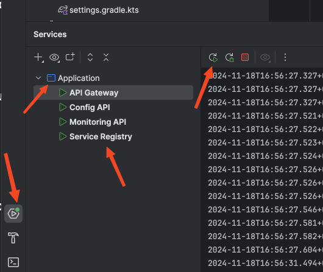

# Running the Spring Boot Multi-Module Application

This guide will help you run the Spring Boot multi-module application using Gradle Kotlin DSL (KTS) and Java 21.

Quick Start from IntelliJ IDEA:
See this


## Prerequisites

- Java 21 installed
- Gradle installed
- An IDE (e.g., IntelliJ IDEA) or a terminal

## Steps to Run the Application

1. **Clone the Repository**

    ```bash
    git clone <repository-url>
    cd <repository-directory>
    ```

2. **Navigate to the Root Directory**

    Ensure you are in the root directory of the multi-module project.

3. **Build the Project**

    Use the following command to build the project:

    ```bash
    ./gradlew build
    ```

4. **Run the Application**

    To run the application, use the following command:

    ```bash
    ./gradlew bootRun
    ```

5. **Access the Application**

    Once the application is running, you can access it at `http://localhost:8080`.

## Additional Commands

- **Clean the Project**

  ```bash
  ./gradlew clean
  ```

- **Run Tests**

  ```bash
  ./gradlew test
  ```

## Troubleshooting

- Ensure that Java 21 is correctly installed and configured.
- Verify that Gradle is installed and accessible from the terminal.
- Check for any errors in the build process and resolve them as needed.

For more detailed information, refer to the official Spring Boot and Gradle documentation.

